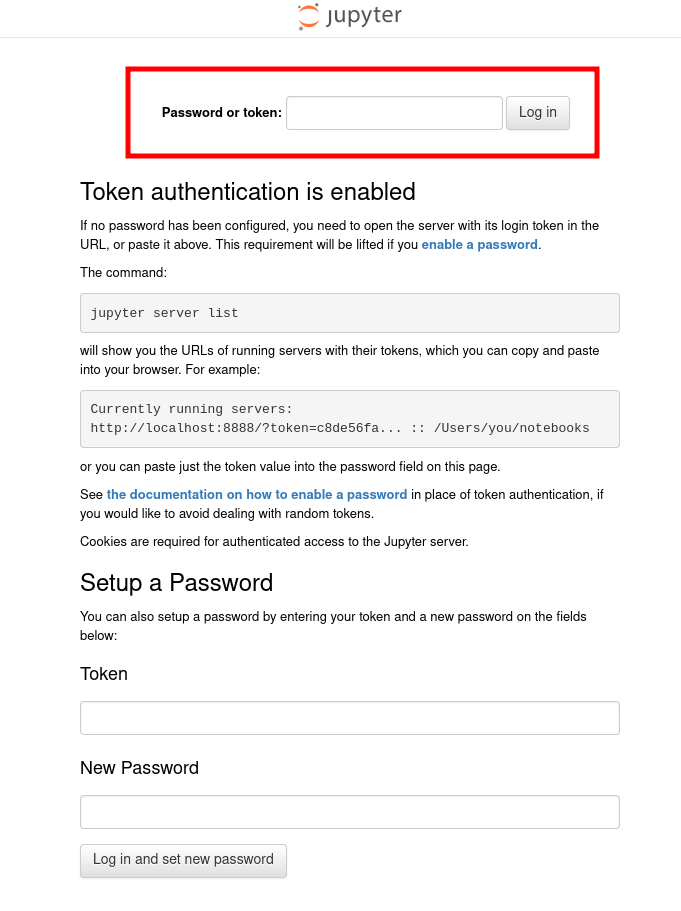

Docker file for single cell analysis.

## [version 0.1](https://github.com/dsb-lab/Docker-single-cell-analysis/tree/v0.1)

The packages explicitly installed in this image are:

> scanpy==1.7.0\
> matplotlib==3.3.4\
> numpy==1.20.1\
> scipy==1.6.0\
> pandas==1.2.2\
> networkx==2.5\
> seaborn==0.11.1\
> scikit-learn==0.24.1\
> fa2==0.3.5 \
> harmonypy==0.0.5\
> MulticoreTSNE==0.1\
> scrublet==0.2.3\
> pygam==0.8.0\
> python-igraph==0.9.6\
> louvain==0.7.0\
> xlsxwriter==1.4.4\
> leidenalg==0.8.7\
> bbknn==1.5.1\
> scanorama==1.7.1\
> phate==1.0.7\
> pypairs==3.2.3\
> phenograph==1.1.14\
> mnnpy==0.1.9.5\
> pydpc==0.1.3\
> sam_algorithm==0.8.7\
> DCA==0.3.4\
> magic-impute==3.0.0\
> palantir==1.0.0\
> trimap==1.0.15

## [version 0.2](https://github.com/dsb-lab/Docker-single-cell-analysis/tree/4d6469fa02e12cd9f198f97f0e2087eb4c99bf4c)

This version incorporates over version 0.2:

> openpyxl==3.0.9

and the git packages for the pyslingshot algorithm.

> [mossjacob/pcurvepy](https://github.com/mossjacob/pcurvepy)\
> [mossjacob/pslingshot](https://github.com/mossjacob/pyslingshot)

## version 0.3

This version incorporates over version 0.2:

> gprofiler-official==1.0.0\
> scikit-misc==0.1.4\
> scvi-tools==0.14.6

For being able to execute the docker with GPUs functionality see [this article](https://towardsdatascience.com/how-to-properly-use-the-gpu-within-a-docker-container-4c699c78c6d1)(Need Different base image in Dockerfile).

## 1. Building the docker
A docker image with the required python version and packages can be created running

```
./build.sh
```

It has been very useful the information from the blog: [https://www.docker.com/blog/multi-platform-docker-builds/](https://www.docker.com/blog/multi-platform-docker-builds/)

## 2. Running the docker
For running the docker and go over the analysis steps in a jupyter lab session, just run,

```
./run.sh
```

Once run, the docker will be working and executing in the channel 10000. Change the channel in the `run` script if you want to run it in some other channel.. In the terminal you will find a token code that is generated for security reasons:


Copy that number. For accessing the session, open your favorite folder brwoser and search `localhost:10000`. Directly from the terminal it will be something like,

```
firefox localhost::10000
```

it will open a jupyterlab session that will ask for a password or token.  



Copy the token you obtained before and you will be set up! 

Anything in the `home` folder can be seen by the docker and you and will be saved after the docker is finished.


